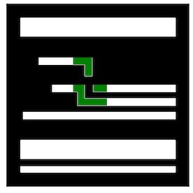

# Why Should I Trust Your Prediction on My Layout? Explanations at the Circuit-Element Level
Tao Zhang, Haoyu Yang, Kang Liu, Zhiyao Xie. "APPLE: An Explainer of ML Predictions on Circuit Layout at the Circuit-Element Level". Asia and South Pacific Design Automation Conference (ASP-DAC) 2024.
## Description  
In this project, we proposed a brand-new algorithm named **apple** to explain the machine learning model's prediction at the resolution level of circuit elements. Particularly, **apple** tests the model's reliability by annotating model's focus region on layouts. A lot of experiments show that **apple** generalizes to various kinds of models surprisingly well.
## Preparation
### Datasets
iccad2012 contest  
benchmark-litho

### Environments
Python: 3.9.13  
PyTorch: 1.12.1  
Torchvision: 0.13.1  
CUDA: 11.3.1  
NumPy: 1.23.1  
## How to run
### settings
**main.py** script tests the performance of assigned models on according datasets.  
Specifically, the path of datasets and model should be edited. Then this script can run successfully.  

**apple_helper.py** script includes the details of how apple evaluates model's performance.    

**functions.py** script comprises some functions that can be called to achieve certain purposes.

### experimental results
The experiment result is reported as a numpy array whose shape is in line with the shape of input data. An example of visualized output is shown below.  

