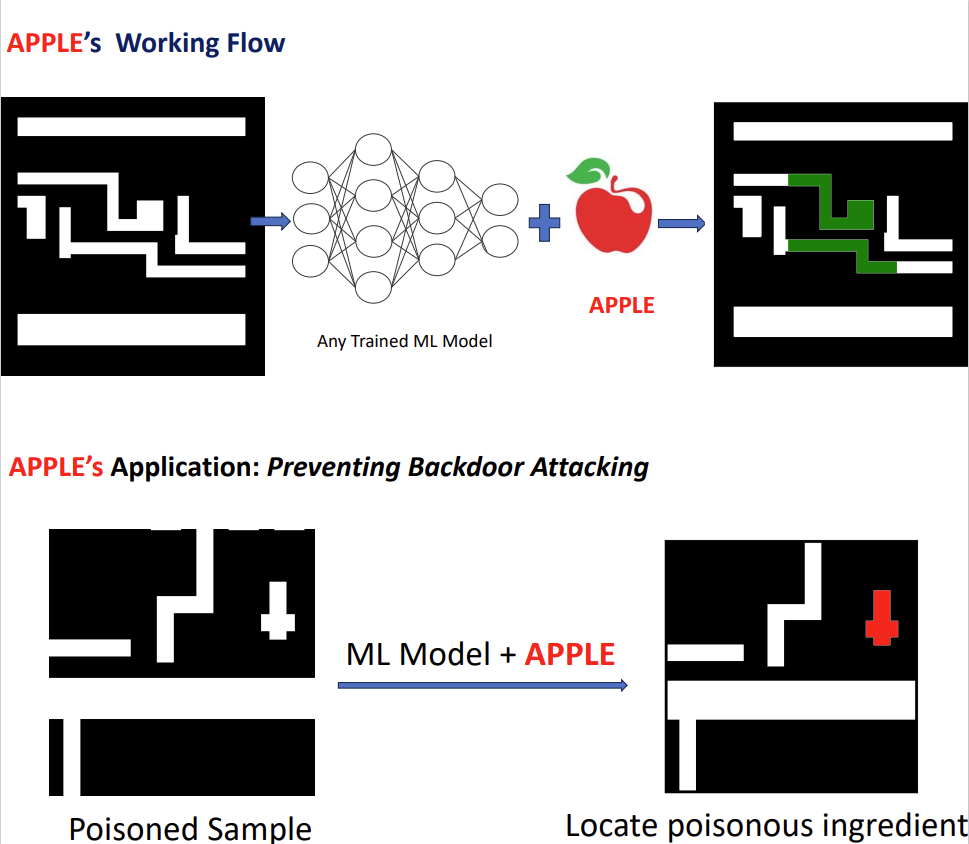

# APPLE: An Explainer of ML Predictions on Circuit Layout at the Circuit-Element Level
Tao Zhang, Haoyu Yang, Kang Liu, Zhiyao Xie. "APPLE: An Explainer of ML Predictions on Circuit Layout at the Circuit-Element Level". Asia and South Pacific Design Automation Conference (ASP-DAC) 2024.
## Description  
In this project, we have proposed an innovative algorithm, denoted as **APPLE**, which serves the purpose of elucidating the predictions made by machine learning models at the resolution level of circuit elements. The main focus of **APPLE** lies in evaluating the reliability of these models by effectively annotating the regions of models' interest within the layouts, thereby providing valuable explanations of the model's prediction result. Through a series of extensive experiments, we have observed that **APPLE** exhibits a remarkable generalization capability across various models and can solve the backdoor attack in lithography hotspot detection quite well, showcasing its strong potential as a robust and versatile tool in the field of explaining machine learning models' prediction.
## Preparation
### Datasets
iccad2012 contest  
benchmark-litho

### Environments
Python: 3.9.13  
PyTorch: 1.12.1  
Torchvision: 0.13.1  
CUDA: 11.3.1  
NumPy: 1.23.1  
## How to run
### settings
**main.py** script tests the performance of any trained models on the corresponding datasets.  
Specifically, the path of datasets and model should be edited. Then this script can run successfully.  

**apple_helper.py** script includes the details of how **APPLE** works and evaluates model's performance.    

**functions.py** script comprises some functions that can be called for special needs.

## Experimental Results
According to the experimental results, **APPLE** highlights the relevant regions, indicated in green, which correspond precisely to the identified lithography hotspots detected through lithography simulation. Moreover, the **APPLE** algorithm proves its effectiveness in mitigating backdoor attacks in hotspot detection, further enhancing its utility in practical applications. An example of visualized output is shown below.  

